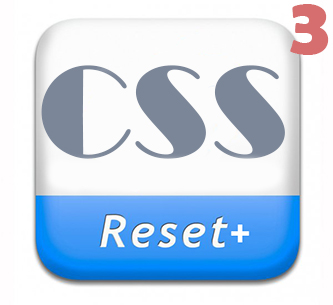

# reset_plus_style

<h2>Reset+ v.3 | Build 06.08.2021 </h2>

<ul>
  <li>Description: Resetting and normalizing browser CSS styles;</li>
  <li>Author: Andrei Ovcharov;</li>
  <li>E-mail: datoshcode@gmail.com;</li>
  <li>Build date: 06.08.2021;</li>
  <li>File name: reset+.css</li>
  <li>License: GNU/GPL.</li>
</ul>  

  Example of connecting to a project in the "index.html" file: 
  <code>&lt;link rel="stylesheet" href="css/reset+.css"&gt;</code>

  

<strong>I use it myself and recommend it to you ! </strong>

